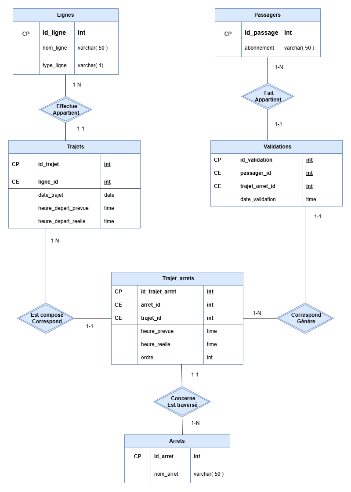

# Analyse d’un réseau de transport urbain (SQL)

Projet d’analyse de données d’un réseau de transport urbain : fréquentation des lignes et des arrêts, retards, ponctualité et périodes de forte affluence.

## Objectifs
- Fréquentation des lignes et des arrêts
- Calcul des retards moyens
- Classement des lignes les plus ponctuelles
- Identification des périodes de forte affluence

## Contenu du dépôt
- `notebook/` : notebook (requêtes SQL + explications)
- `sql/schema.sql` : création des tables
- `sql/requetes.sql` : requêtes d’analyse rangées par objectifs
- `presentation/` : présentation du projet (PDF)
- `assets/` : ressources (schéma, images)

## Schéma relationnel

## Technologies
SQL (syntaxe SQLite via `strftime`), Jupyter Notebook, présentation Canva (export PDF)

## Résultats (synthèse)
- Les retards se concentrent pendant les pics (matin / fin de journée)
- Certains arrêts ressortent comme points critiques pendant les heures de pointe
- Les indicateurs permettent de cibler des renforts aux bons créneaux
